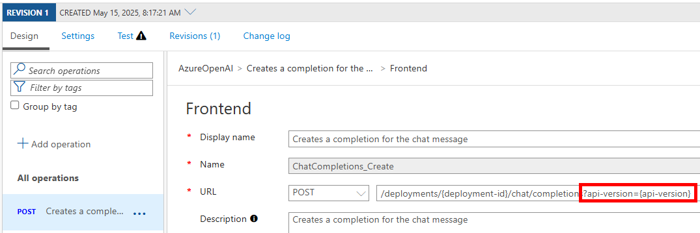
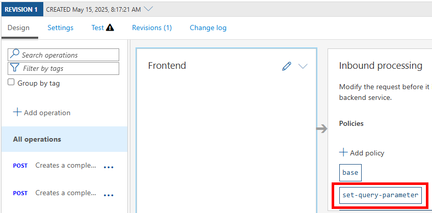

# API Management, Azure OpenAI and OpenAI SDK

## Scenario

You want to use OpenAI SDK to call Azure OpenAI instances exposed via Azure API Management deployed
using the following examples:

[Scenario 1: Azure API Management - Secure Baseline](https://github.com/Azure/apim-landing-zone-accelerator/tree/main/scenarios/apim-baseline)
and
[Scenario 3: Azure API Management - Generative AI resources as backend](https://github.com/Azure/apim-landing-zone-accelerator/tree/main/scenarios/workload-genai)

Since OpenAI SDKs use `base_url` and then appends to that path depending on the called API,
you would need to change the url behavior of the deployed environment a bit.

Instead of calling APIs with `api-version` like this:

```
https://apim.contoso.com/openai/deployments/aoai/chat/completions?api-version=2024-02-15-preview
```

You would need to call them without it and set that automatically inside APIM policy _if not provided by end user_:

```
https://apim.contoso.com/openai/deployments/aoai/chat/completions
```

Remove `api-version` requirement from API:



Add `set-query-parameter` policy:



[Set query string parameter](https://learn.microsoft.com/en-us/azure/api-management/set-query-parameter-policy):

```xml
<policies>
    <inbound>
        <base />

        <!-- This is added: -->
        <set-query-parameter name="api-version" exists-action="skip">
            <value>2024-02-15-preview</value>
        </set-query-parameter>

        <!-- abbreviated -->
    </inbound>
    <!-- abbreviated -->
</policies>
```

Now you can test this with `curl`:

```bash
curl --resolve apim.contoso.com:443:123.123.123.123 -k \
  -H 'Content-Type: application/json' \
  -H 'Ocp-Apim-Subscription-Key: eb3...bd' \
  https://apim.contoso.com/openai/deployments/aoai/chat/completions \
  -d '{"messages": [{"role":"system","content":"You are an AI assistant that helps people find information."}]}'
```

Now you can test it with OpenAI SDK:

```bash
# Create a virtual environment and install dependencies
python -m venv .venv

# Activate the virtual environment
.venv\scripts\activate

# Install dependencies
pip install -r requirements.txt

python main-openai.py
```

```console
(.venv) $ python main-openai.py
Request will be sent to: https://apim.contoso.com/openai/deployments/aoai/chat/completions
Using model deployment: gpt-4o-mini

Sending message to AI: "Hello! Tell me a brief fun fact about cloud computing."
Sending request...
Request completed in 5.46 seconds

AI response:
Hello! Here's a fun fact about cloud computing: The concept of cloud computing dates back to the 1960s! Computer scientist J.C.R. Licklider envisioned an "Intergalactic Network" that would allow everyone to access data and programs from anywhere. This vision laid the groundwork for the cloud services we use today, where data can be accessed anytime, anywhere, over the internet!
```

You can use `main-openai-verbose.py` version of the app to have a lot more logging to help you troubleshoot potential problems.